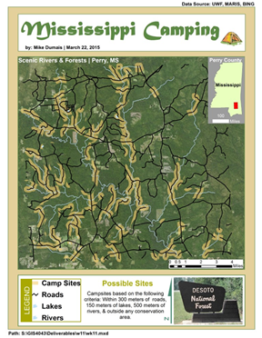

  <!--  -->

## Overview

This coursework project for GIS-4043: Introduction to GIS applied proximity and overlay analysis techniques in ArcGIS to help identify optimal campsite locations relative to nearby roads, lakes, and rivers.

## The Problem

Choosing a good campsite depends on more than just terrain — proximity to roads for access, water sources like lakes and rivers, and other environmental features all factor into the decision. This project set out to answer a practical question: **which campsites are best positioned relative to these surrounding features?**

## Approach

**Proximity Analysis**
Proximity analysis was used to examine the spatial relationships between campsite locations and nearby features such as roads, lakes, and rivers. By analyzing distances and adjacency between feature sets, the analysis generated new information about which campsites offered the most favorable access to these resources.

**Overlay Analysis**
GIS overlay tools were used to combine features and attributes from multiple layers, carrying both geometries and attribute data through the overlay process. This made it possible to synthesize information across layers — roads, hydrology, and campsite locations — into a single, analyzable dataset.

Together, these techniques transformed raw spatial data into actionable insight: a clearer picture of which campsites were best suited for selection based on their surrounding features.

## Tools Used

- ArcGIS (Desktop/Pro)
- GIS Overlay Tools (Union/Intersect)
- Proximity/Buffer Analysis Tools

## Outcome

The result was a set of campsite recommendations grounded in spatial analysis rather than guesswork — demonstrating how proximity and overlay techniques can turn layered spatial data into practical, decision-ready information.

---

*Coursework project completed as part of GIS-4043: Introduction to GIS.*