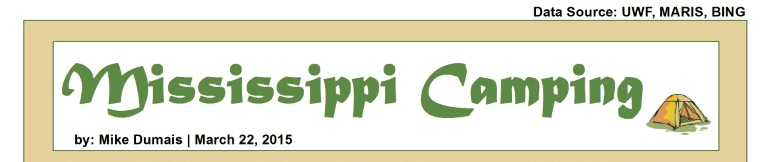

---
hide:
  - toc
  - navigation
---
<!--
CHECKLIST FOR THIS PAGE:
- [ ] Replace the two placeholder cards (marked [YOUR PROJECT ...]) with your real projects
- [ ] For each project: add a thumbnail image to docs/assets/images/ and update the path below
- [ ] For each project: create a project page by copying sample-project.md
- [ ] For each project: add a nav entry in mkdocs.yml (see the comments there)
- [ ] Delete placeholder cards you don't need yet
-->

# Projects

A selection of my geospatial projects. Click any card to see the full write-up.

<!--  -->

  

**[GIS-4043](GIS-4043.md)**

This map involved some spatial analysis where I examined locations, attributes, and relationships of features in spatial data through overlay and other analytical techniques to obtain knowledge of campsites near other features (roads, lakes, and rivers) that might be helpful when selecting a campsite.

`[TOOL 1]` `[TOOL 2]` `[TOOL 3]`

[View Project →](GIS-4043.md){ .md-button }

<!-- 
 -->

  

  **[GIS-3015](sample-project.md)**

  [YOUR PROJECT DESCRIPTION — one or two sentences: what you did, what data you used,
  and what you found or built.]

  `[TOOL 1]` `[TOOL 2]` `[TOOL 3]`

  [View Project →](GIS=3015.md){ .md-button }

  

  **[Project 3](p3.md)**

  [YOUR PROJECT DESCRIPTION — one or two sentences: what you did, what data you used,
  and what you found or built.]

  `[TOOL 1]` `[TOOL 2]` `[TOOL 3]`

  [View Project →](p3.md){ .md-button }

  

  **[Project 4](p4.md)**

  [YOUR PROJECT DESCRIPTION — one or two sentences: what you did, what data you used,
  and what you found or built.]

  `[TOOL 1]` `[TOOL 2]` `[TOOL 3]`

  [View Project →](p4.md){ .md-button }

  

  **[Project 5](p5.md)**

  [YOUR PROJECT DESCRIPTION — one or two sentences: what you did, what data you used,
  and what you found or built.]

  `[TOOL 1]` `[TOOL 2]` `[TOOL 3]`

  [View Project →](p5.md){ .md-button }

  

  **[Sample Project](sample-project.md)**

  [YOUR PROJECT DESCRIPTION — one or two sentences: what you did, what data you used,
  and what you found or built.]

  `[TOOL 1]` `[TOOL 2]` `[TOOL 3]`

  [View Project →](sample-project.md){ .md-button }

  

  **[Sample Notebook](sample-notebook.ipynb)**

  [YOUR PROJECT DESCRIPTION — one or two sentences: what you did, what data you used,
  and what you found or built.]

  `Python` `pandas` `Folium`

  [View Project →](sample-notebook.ipynb){ .md-button }

